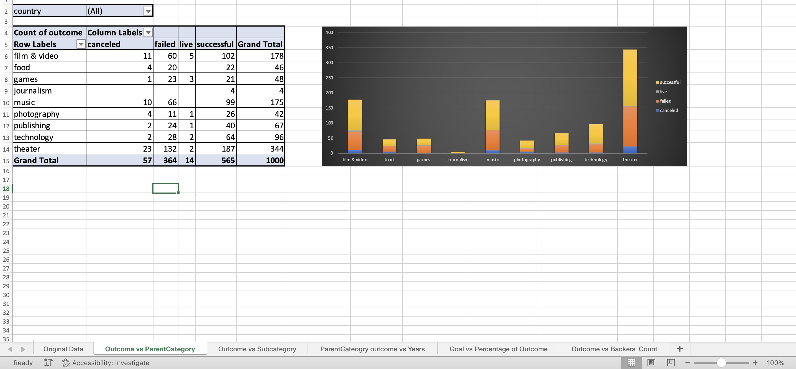
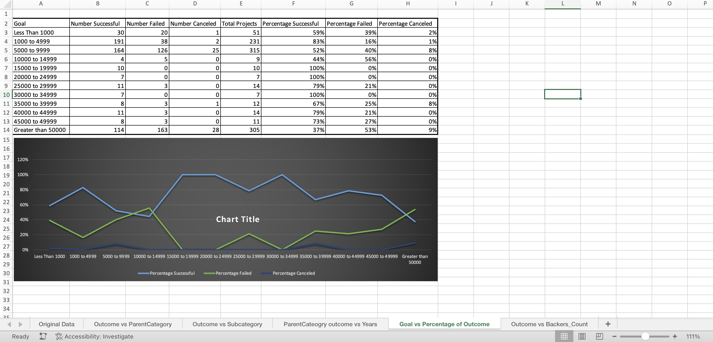
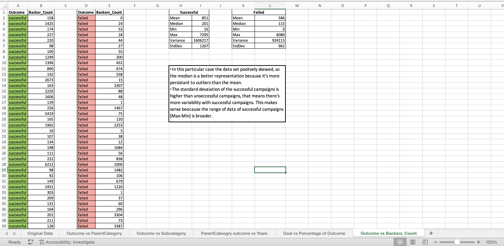

# Crowdfunding_Projects_Analysis

## Organize and analyze a database of 1000 sample projects to uncover any hidden trends with crowdfunded projects.

#### The following data analysis methods were used to analyse the data and present a written report with the conculsions 

- Pivot Tables
- Conditional Formatting
- Stacked-Column Pivot Chart

  

- Pivot-Chart Line Graph

  

- Statistical Analysis

  

